# **Socks Shop Microservices-based Application Deployment on Kubernetes using IaC.**

**PROJECT LIVE LINK:** [CAPSTONE PROJECT LINK](http://tambu.tech)

##

## **Project Overview:**

The Socks Shop application is a popular microservices-based e-commerce platform that is used as a reference application for demonstrating modern cloud-native technologies. The application is composed of multiple microservices, each of which is responsible for a specific function, such as product catalog, shopping cart, and user authentication. The application is designed to be highly scalable, resilient, and fault-tolerant, making it an ideal candidate for deployment on Kubernetes.

The project will involve deploying the Socks Shop application on a Kubernetes cluster using an Infrastructure as Code (IaC) approach. This will include provisioning the necessary infrastructure resources on AWS, setting up a deployment pipeline, monitoring the performance and health of the application, and securing the infrastructure.

The project will be implemented using Terraform for infrastructure provisioning, GitHub Actions for the deployment pipeline, Kubernetes for container orchestration, Helm for package management, Prometheus for monitoring, ELK Stack for logging, and Ansible for security.

## **This project will include the following components:**

- [Infrastructure Provisioning](#infrastructure-provisioning)
- [Deployment Pipeline](#deployment-pipeline)
- [Monitoring](#monitoring)
- [Security](#security)
- [conclusion](#conclusion)


## **Project Requirements:**

- Terraform
- AWS Account
- Kubernetes
- Helm
- Prometheus/Grafana
- Let's Encrypt
- Socks Shop Application

## **Project Deliverables:**

- Terraform configuration files for provisioning the infrastructure on AWS
- Deployment pipeline configuration using GitHub Actions
- Kubernetes manifests for deploying the Socks Shop application
- Prometheus configuration for monitoring the Socks Shop application
- Documentation on how to run the project

## **Project Structure:**

```
socks-shop-deploy/
├── .github/
│   └── workflows/
│       └── ci-cd.yaml    # GitHub Actions workflow for CI/CD
├── k8s/
│   ├── deployment.yaml   # Kubernetes deployment manifests
│   └── ingress.yaml      # Kubernetes ingress manifest
├── terraform/
│   ├── main.tf         # Main Terraform configuration for AWS EKS
│   ├── terraform.tf    # Terraform configuration
│   ├── outputs.tf      # Terraform output
└──README.md
```

The project will be organized into the following directories:

- `Infrastructure`: This directory will contain the Terraform configuration files for provisioning the necessary infrastructure resources on AWS, including VPCs, subnets, security groups, and EKS cluster.
- `kubernetes`: This directory will contain the Kubernetes manifests for deploying the Socks Shop application, including deployment and ingress resources.
- `CI/CD`: This directory will contain the GitHub Actions workflow files for setting up a deployment pipeline to build and deploy the Socks Shop application to the Kubernetes cluster.
- `Monitoring`: This directory will contain the configuration files for setting up Prometheus to monitor the performance and health of the Socks Shop application.


The project will also include a `README.md` file in each directory to provide detailed instructions on how to set up and configure the components.

## **Prerequisites:**

The following tools and technologies will be used in the project:

- Terraform: Terraform is an open-source infrastructure as code software tool that provides a consistent CLI workflow to manage hundreds of cloud services. It codifies APIs into declarative configuration files, creating infrastructure as code using a high-level configuration language called HCL (HashiCorp Configuration Language).

- AWS Account: An AWS account will be required to provision the necessary infrastructure resources, such as VPCs, subnets, security groups, and EKS cluster.

- GitHub Actions: GitHub Actions will be used to set up a deployment pipeline to build and deploy the Socks Shop application to the Kubernetes cluster.

- Kubernetes: Kubernetes is an open-source container orchestration platform that automates the deployment, scaling, and management of containerized applications.

- Helm: Helm is a package manager for Kubernetes that provides an easy way to find, share, and use software built for Kubernetes.

- Prometheus: Prometheus is an open-source monitoring and alerting toolkit designed for reliability and scalability. It collects metrics from configured targets at given intervals, evaluates rule expressions, displays the results, and can trigger alerts if some condition is observed to be true.

- Let's Encrypt: Let's Encrypt is a free, automated, and open certificate authority brought to you by the nonprofit Internet Security Research Group (ISRG).

- Socks Shop Application: The Socks Shop application is a popular microservices-based e-commerce platform that is used as a reference application for demonstrating modern cloud-native technologies.

## **Project Objectives:**

The main objectives of the project are as follows:

- Deploy the Socks Shop application on a Kubernetes cluster using an Infrastructure as Code (IaC) approach
- Provision the necessary infrastructure resources on AWS, including VPCs, subnets, security groups, and EKS cluster
- Set up a deployment pipeline using GitHub Actions to build and deploy the Socks Shop application to the Kubernetes cluster
- Monitor the performance and health of the Socks Shop application using Prometheus

#

## **GETTING STARTED**

Socks Shop Resources: https://github.com/microservices-demo/microservices-demo.github.io

Demo: https://github.com/microservices-demo/microservices-demo/tree/master

## **Infrastructure Provisioning:**

Using Terraform, we will provision the necessary infrastructure resources on AWS, including VPCs, subnets, security groups, and EKS cluster. This will allow for a clear and reproducible infrastructure setup.

1.  Make sure you have installed Terraform alongside AWS CLI on your local machine. If not, you can download it from the official website.

    [AWS CLI Installation guide](https://aws.amazon.com/cli/)

    [Terraform Download](https://www.terraform.io/downloads.html)

2.  Create a new directory for the Terraform configuration files and navigate to it.

        mkdir Terraform
        cd Terraform

3.  Git clone this repository and navigate to the terraform folder to have the Terraform configuration files and initiate the Terraform project.

        git clone https://github.com/donfortune/Socks-Shop/Terraform

4.  Run the following command to initialize the Terraform project:

        terraform init

5.  Run the following command to create an execution plan:

        terraform plan

6.  Run the following command to apply the changes:

        terraform apply --auto-approve

Below is a screenshot of my EKS cluster being provisioned by terraform👇🏽:

  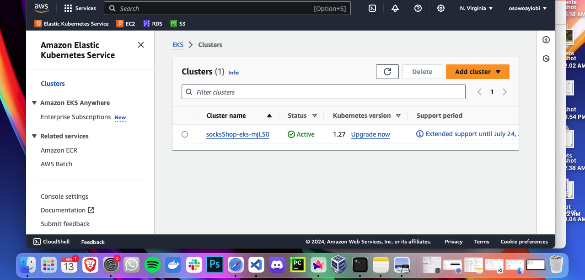

This below command allow us to configure the kubectl to connect to the EKS cluster, the specified region and the cluster name.

    aws eks update-kubeconfig --name=socksShop-eks-mjlSO --region=us-east-1

7.  After the infrastructure has been provisioned, you will see the output of the Terraform apply command, including the EKS cluster endpoint and the kubeconfig file.

- We apply our deployment manifests to our cluster using the following command:

        kubectl apply -f k8s/deployment.yaml

    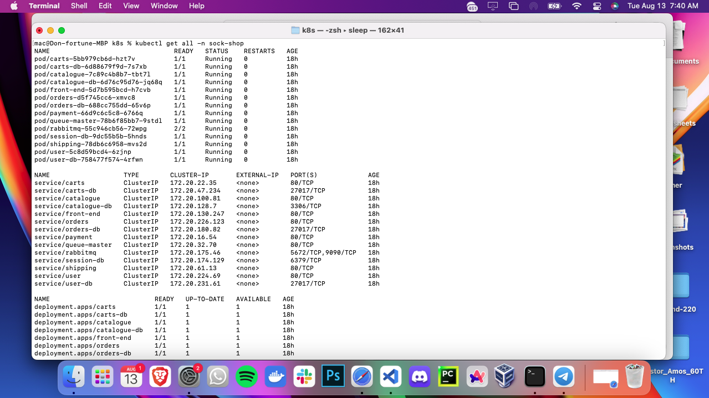
    
    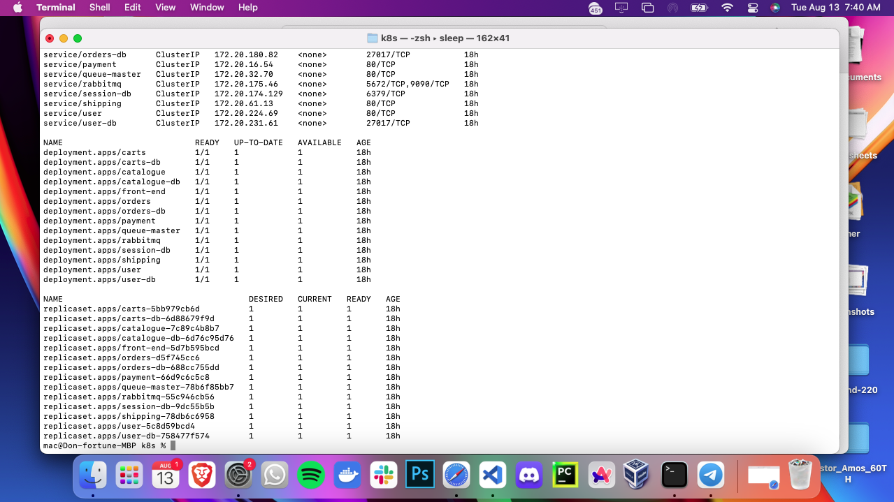

8. After we confirm that our pods are running, we now need to expose our application to the outside world using ingress

       kubectl apply -f k8s/ingress.yaml
      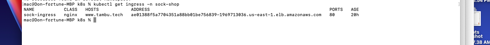
    
9. You can now check your domain [CAPSTONE PROJECT LINK](https://tambu.tech)

    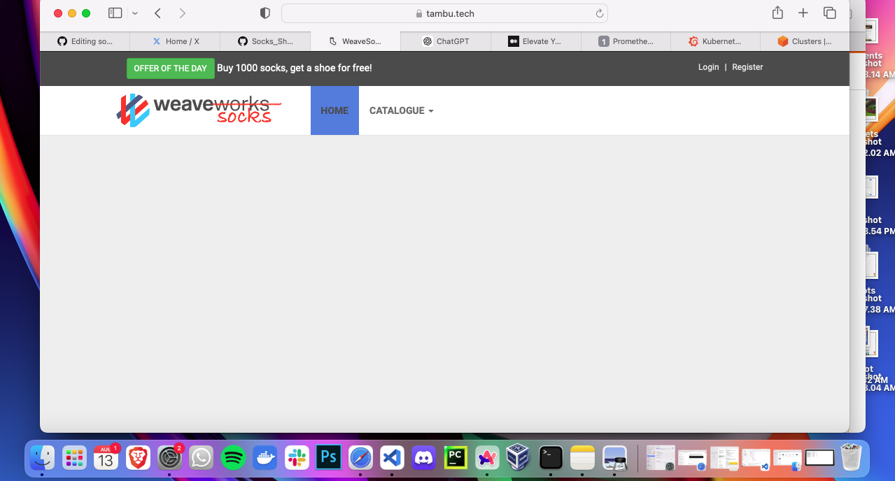

    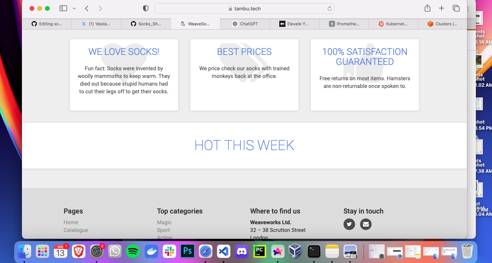

## **Security Let's Encrypt:**

1. Securing my Domain with Lets Encrypt
          brew install certbot
    
          sudo certbot certonly --manual --preferred-challenges dns -d tambu.tech -d www.tambu.tech
    
        Follow the instructions to create a DNS TXT record:
        Certbot will ask you to create a TXT record for your domain.
        Go to your DNS provider’s dashboard and add the TXT record as instructed.
        Verify the DNS record and obtain the certificate:
        Certbot will then proceed to obtain the certificate once the DNS record is confirmed.
    
          kubectl create secret tls tambu-tech-tls \
          --cert=/etc/letsencrypt/live/tambu.tech/fullchain.pem \
          --key=/etc/letsencrypt/live/tambu.tech/privkey.pem
2. Modify your Ingress resource to use the new TLS secret:
    
            apiVersion: networking.k8s.io/v1
            kind: Ingress
            metadata:
              name: sock-ingress
              namespace: sock-shop
              annotations:
                nginx.ingress.kubernetes.io/ssl-redirect: "true"
            spec:
              tls:
                - hosts:
                    - tambu.tech
                  secretName: tambu-tech-tls
              rules:
                - host: tambu.tech
                  http:
                    paths:
                      - path: /
                        pathType: Prefix
                        backend:
                          service:
                            name: front-end
                            port:
                              number: 80

  ## **Monitoring:**

1. Using Helm and Prometheus to Enable MOnitoring into the cluster
      helm repo add prometheus-community https://prometheus-community.github.io/helm-charts
      helm repo update

      helm install prometheus prometheus-community/kube-prometheus-stack -n monitoring

      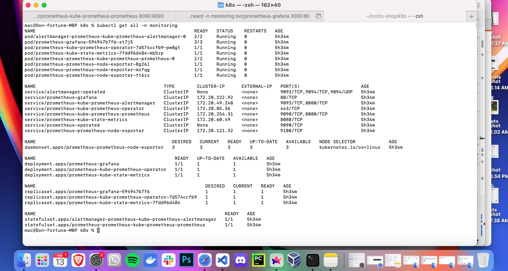

      kubectl port-forward -n monitoring svc/prometheus-kube-prometheus-prometheus 9090:9090

      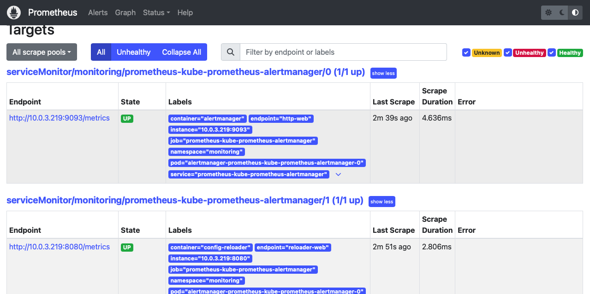

      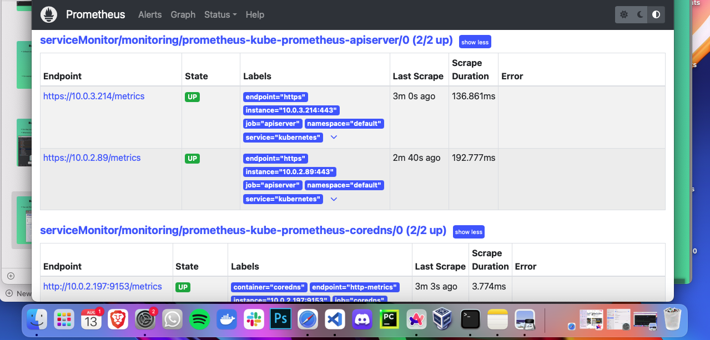

      kubectl port-forward -n monitoring svc/prometheus-grafana 3000:80

      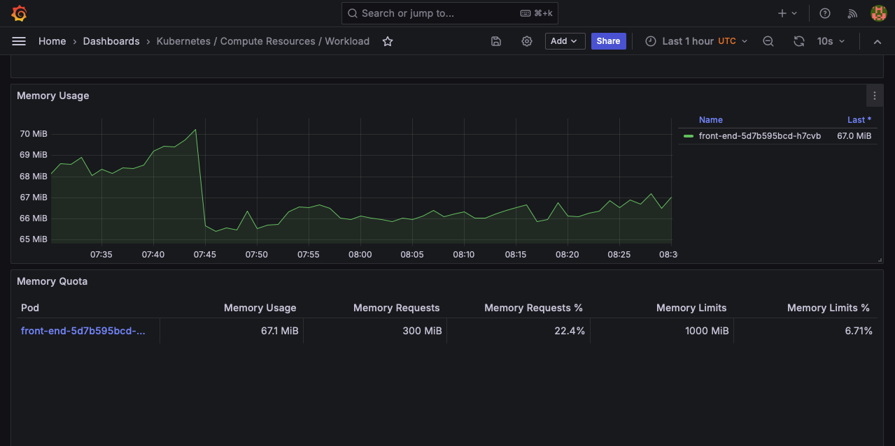

      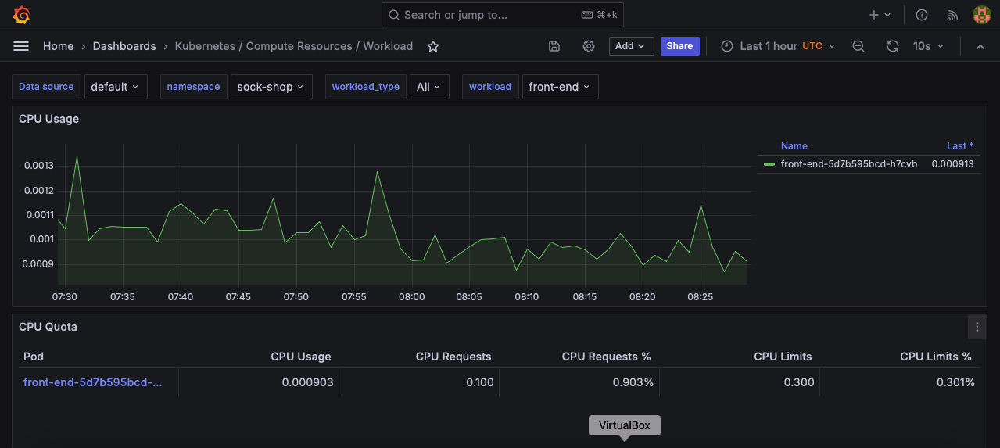

      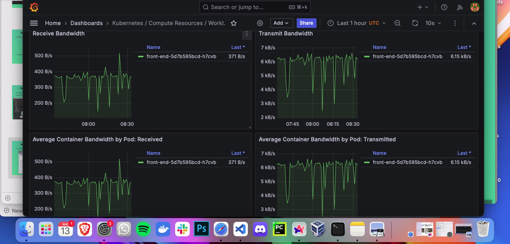


## **Deployment Pipeline:**

The deployment pipeline will be configured using a GitHub Actions workflow file, which will define the steps required to build and deploy the Socks Shop application. The workflow file will be triggered by a push to the main branch of the repository, and will include the following steps:

Our workflow file must be in our root directory for our GitHub Actions to detect the file automatically.

- Checkout the source code from the repository
- Build the Docker images for the Socks Shop application
- Deploy the Socks Shop application to the Kubernetes cluster

The deployment pipeline will be configured to run automatically whenever changes are pushed to the main branch of the repository, ensuring that the Socks Shop application is always up to date and running the latest version.

## **Conclusion:**

This project will provide hands-on experience with Infrastructure as Code, Kubernetes, DevOps best practices, and cloud security. It will also demonstrate the value of automation and monitoring in ensuring the reliability and performance of microservices-based applications. By the end of the project, you will have a fully functional deployment pipeline for the Socks Shop application, including infrastructure provisioning, monitoring, logging, and security.


